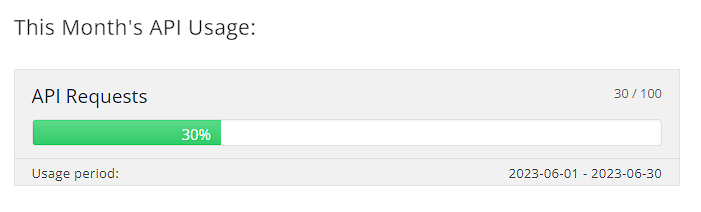
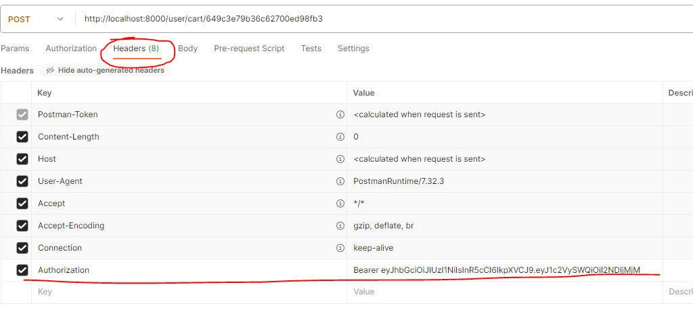

# Project Title

Backend of an online delivery shop.

## Table of Contents

- [Project Description](#project-description)

  - [Prerequisites](#prerequisites)
  - [Installation](#installation)

- [API Documentation](#api-documentation)

## Project Description

This the back-end of an online delivery application that allows guest users to view items & submit orders. There is also a simple web-page done in plain html that allows the admin(admin e-mail and password are provided in the html page )  so he can view the orders and even change one of their attributes to from 'waiting' to 'completed'. The backend is done in nodejs and the database is mongodb hosted on the mongoatlas.

### Prerequisites

Nodejs,Postman Desktop Application for testing end points through this collection https://www.postman.com/winter-astronaut-614435/workspace/debox/collection/18021096-f018896d-0696-45ca-80c8-a9c5c67b6f67?action=share&creator=18021096 

### Installation

To install and run the application, follow these steps:

1. Clone the repository to your local machine.
2. Open a terminal and navigate to the project directory.
3. Run the following command:
   npm run install-run

This script will install the dependencies specified in the package.json file and start the application using nodemon.

Make sure you have Node.js and npm installed on your machine with the versions specified in the engines section of the package.json file.

## API Documentation
This nodejs project runs locally on port 8000 so makesure that port isnt in use in your machine. It is  connected to an online mongo database , it also makes axios calls to the fixer.io api to make currency conversions, it is a free tier so there is a chance those api calls ran out and the app crashes . Please run the requests on an application like Postman.

- The app has access to a food collection in the mongo database which one can access at GET http://localhost:8000/food/ .It allows to  also access foods by category  GET http://localhost:8000/food/:category   (Beverages/Main Dishes/Appetizers) , or get only vegan foods or only allergen free foods GET http://localhost:8000/food/vegan , GET http://localhost:8000/food/allergenfree .
Finally one  can add <?currency=   >   like so GET http://localhost:8000/food/?currency=USD for example to convert the food.price in USD currency from EUR which is the default currency.

-The app supports sign up through a post request at POST http://localhost:8000/user/signup  using a body like 
{
  "email": "example@example.com",
  "password": "password123",
  "firstName": "John",
  "lastName": "Doe",
  "address": "123 Street",
  "phone": "1234567890"
}  
and once  you are signed up you can use the login endpoint POST http://localhost:8000/user/login as post request  , to skip the sign up  {
  "email": "example@example.com",
  "password": "password123"} credentials are provided for test purposes.
Once you log in copy take the token response from the post request and make an Autorization key in the headers section of post man like so   . *Note that by accessing the postman collection link i posted above this probably doesnt have to be done manually and you can just launch the app open the collection on the postman app and work from there withthe keys already saved in those collections.

http://localhost:8000/user/profile where you can see current logged users profile
Once logged in as a user there are the following endpoints    http://localhost:8000/user/cart/:id where you add item with _id= :id to your cart ( like 649c3e79b36c62700ed98fae ,649c3e79b36c62700ed98fb1 )
http://localhost:8000/user/cart/:id/qty where you can edit the quantity of an item in your cart. 
http://localhost:8000/user/add-order you add your carts contents to the order collection .
http://localhost:8000/user/order where you can view all your orders

Finally the app has a seperate log in for the admin/merchant which is done from http://localhost:8000/authlogin.html and  this allows  to access all the orders in the collection , see which ones are pending and mark some as completed all through axios calls to endpoints like these 
http://localhost:8000/auth/login
http://localhost:8000/merchant/viewall 
http://localhost:8000/merchant/pendingorders and 
http://localhost:8000/merchant/completedorder/:orderID
  

  Web app link again http://localhost:8000/authlogin.html
Again all these can be tested from postman and the link i posted.

## Deployment

No cloud deployment as of right now , hopefully i can do it asap.

